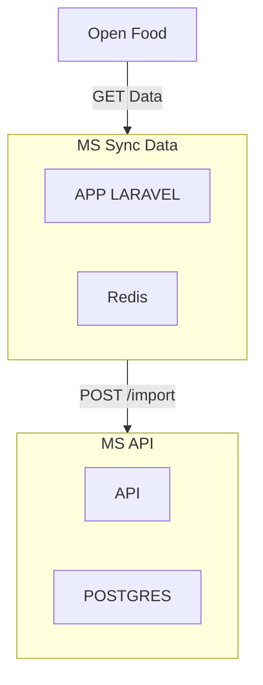

# FITNESS FOODS APP

This project imports and synchronizes data from Open Food Facts using two microservices: one to fetch and process data, and another to handle CRUD operations and store data.

## Architecture



## Running the project

```sh
docker compose up -d
```
```sh
docker compose exec sync-data php artisan queue:work
```
```sh
docker compose exec sync-data php artisan openfoodfacts:import
```